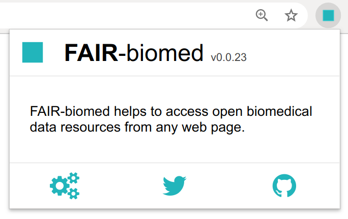
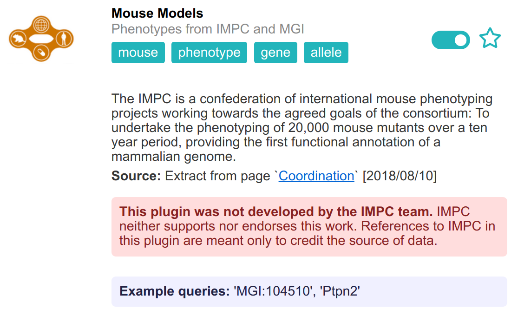

The extension has a dedicated page where you can tune several options. To manage these settings:
 
 - Find the FAIR-biomed icon on the browser toolbar (usually in the top-right). Click on that icon and a small menu will appear.

 - Click on the cog icon, <i class="fas fa-cogs"></i>, and a new tab will display the extension options. 

## Choice of plugins

The bulk of the options page consists of a list of the available plugins. As an example, one of the items describes the IMPC plugin. 

As shown in the screenshot above, each plugin carries a description and other helpful paragraphs. The visibility of this information can be toggled by clicking anywhere within the item. The descriptions typically describe the data resource that powers the plugin, and provides a few example queries.
 
Each plugin has a slider and a star icon. The slider turns a plugin on and off. When a plugin is on, it can appear in the list of suggestions when the plugin detects that the query is appropriate. When it is off, the plugin never appears in the list of suggestions. Setting some plugins to the off state is an effective way of limiting the number of suggestions that appear in the popups. 

The star button next to the slider marks the plugin as a "favorite". This status is displayed in the list of suggestions, but does not otherwise affect the presentation of the suggestions.

## Usage statistics

Whenever the extension executes a plugin to fetch data from an external resource, it records usage in an internal data structure. This data is private to each computer and is not shared - see the [privacy page](../privacy/) page for more information. The usage statistics are used, however, to tune the appearance of plugin suggestions. This allows the extension to learn, over time, which plugins are most useful and to place them nearer to the top of the suggestions list. 

It is possible to reset these usage statistics. The options page has a dedicated button to erase all the usage counts.

## Auto-selection

By default, whenever the extension is invoked from a web page, it displays a list of suggested plugins. It is possible to change this behavior so that the extension automatically selects the last-used plugin for any new query. The switch to this effect is found near the bottom of the options page.

## Local URLs

The extension is active on all pages that have urls that start with 'http' or 'https'. By default - for security reasons - the extension is not active when viewing pages hosted on a local computer, i.e. files from a local disk. 

To use the extension with local URLs, you must enable this functionality manually. This behavior is not determined by the extension itself, but rather by the browser. In chrome:
 
 - Select `More tools > Extensions` from the chrome menus; a new tab should appear listing all your installed extensions
 
 - Find `FAIR-biomed` and click `Details`; the view should change and display information about the extension
 
 - Scroll down to turn the switch labeled `Allow access to file URLs`.

